## Contexto do Problema

- Problema do Caixeiro Viajante (PCV)

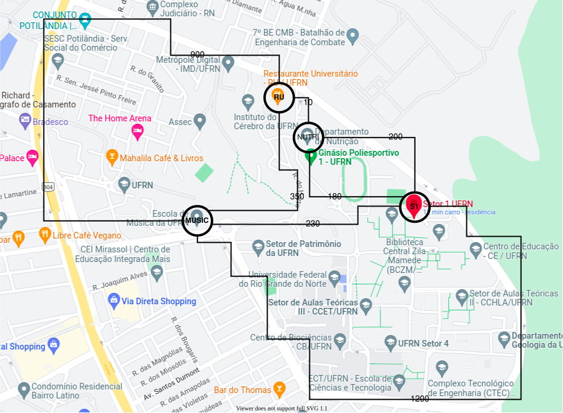{#fig-pcv}

## Contexto do Problema

- Problema do Caixeiro Viajante Quadrático (PCVQ)

```{python}
#| label: fig-simple-graph
#| fig-cap: "PCV vs PCVQ"
#| fig-align: center

import matplotlib.pyplot as plt
import networkx as nx

def draw_graph(G, pos, title, ax):
    """ Função auxiliar para desenhar um grafo """
    nx.draw(G, pos, with_labels=True, node_color='skyblue', node_size=2000, ax=ax)
    edge_labels = nx.get_edge_attributes(G, 'weight')
    nx.draw_networkx_edge_labels(G, pos, edge_labels=edge_labels, ax=ax)
    ax.set_title(title)

G = nx.Graph()
vertices = ['v1', 'v2', 'v3', 'v4']
G.add_nodes_from(vertices)
edges = [('v1', 'v2', 3), ('v2', 'v3', 4), ('v3', 'v4', 5), ('v4', 'v1', 6)]
G.add_weighted_edges_from(edges)

pos = nx.circular_layout(G)

fig, axes = plt.subplots(1, 2, figsize=(10, 4))

draw_graph(G, pos, "Problema do caixeiro viajante (PCV)", axes[0])

draw_graph(G, pos, "Problema do caixeiro viajante quadrático (PCVQ)", axes[1])

qtsp_annotations = [
    ("c(v1,v2,v3)", (0.5, 0.9)),
    ("c(v2,v3,v4)", (0.9, 0.5)),
    ("c(v3,v4,v1)", (0.5, 0.1)),
    ("c(v4,v1,v2)", (0.1, 0.5))
]
for text, position in qtsp_annotations:
    axes[1].text(position[0], position[1], text, horizontalalignment='center', fontsize=12, color='red')

plt.tight_layout()
plt.show()
```

## Contexto do Problema

#### Função Objetivo do PCV
$$ c(v_n, v_1) + \sum^{n-1}_{j=1} c(v_j, v_{j+1}) $$
  
#### Função Objetivo do PCVQ
$$ c(v_{n-1}, v_n, v_1) + c(v_n, v_1, v_2) + \sum^{n-2}_{j=1} c(v_j, v_{j+1}, v_{j+2}) $$

## Aplicações

- Bioinformática
    - Identificação de sítios de ligação + cadeias de markov gera PCVQ
- Robótica 
    - Veículo dubins
- Logística
    - Mudança de meios de transporte

:::{.notes}

# Angular TSP

Procura minimizar o ângulo total de um passeio TSP para um conjunto de
pontos no espaço euclidiano, onde o ângulo de um passeio é o
soma das mudanças de direção nos pontos.

# Dubins

Caminho dubin é a solução para a determinação do caminho ótimo entre dois pontos quaisquer utilizando 
uma restrição de curvatura.

Veículos Nonholonomic tem restrições me ir para os lados.

O autor reduz o comprimento dos caminhos para robôs não holonômicos 
modelados como um veículo de Dubins. Usam uma formulação do caixeiro viajante 
para encontrar a melhor sequência de pontos em um espaço bidimensional. 
Além disso fornece um algoritmo para calcular o melhor circuito de dubins
:::

## Objetivos{.smaller}
- Propor algoritmos evolucionários para o PCVQ
    - Explorar o estado da arte;
    - Desenvolver algoritmos meta-heurísticos evolucionários;
    - Implementar uma abordagem exata e abordagens heurísticas para estabelecer comparação;
    - Investigar a qualidade e tempo das soluções produzidas.

## Metodologia{.smaller}

- Exploratória e experimental
- Investigação em repositórios de artigos identificou 11 trabalhos relacionados;
- Geração de casos de teste simétricos: 5 variações de grafos para vértices variando de 5 a 14, além de 50, 75 e 100
- Utilização da ferramenta Irace para ajuste de parâmetros
- Utilização do teste de Friedman e Nemenyi para análise estatística

# Algoritmos investigados

## Força bruta

:::{layout-ncol=2}
```{mermaid}
graph TD
    B[Gerar todas as permutações possíveis das cidades]
    B --> D[Selecione uma permutação]
    D --> E[Calcule o custo]
    E --> F[Melhor custo até o momento?]
    F -->|Sim| G[Atualizar o menor custo]
    F -->|Não| H
    G --> H
    H[Todas as permutações foram avaliadas?]
    H -->|Sim| I[Fim]
    H -->|Não| D
```

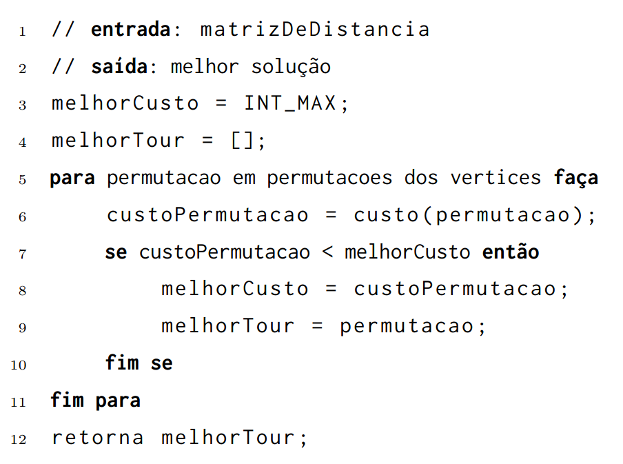{#fig-algo-forca-bruta}
:::

## Inserção mais barata

:::{layout-ncol=2}

```{mermaid}
%%| fig-width: 10
graph TD
    B["Escolha de 2 vértices de forma que pred(v_1) e suc(v_2) sejam mínimos"]
    B --> C[Selecione um vértice não inserido]
    C --> D[Calcule o custo de inserção para todas as posições possíveis]
    D --> E[Insira o vértice na posição de menor custo]
    E --> F[Todos os vértices foram inseridos?]
    F -- Sim --> G[Fim]
    F -- Não --> C
```

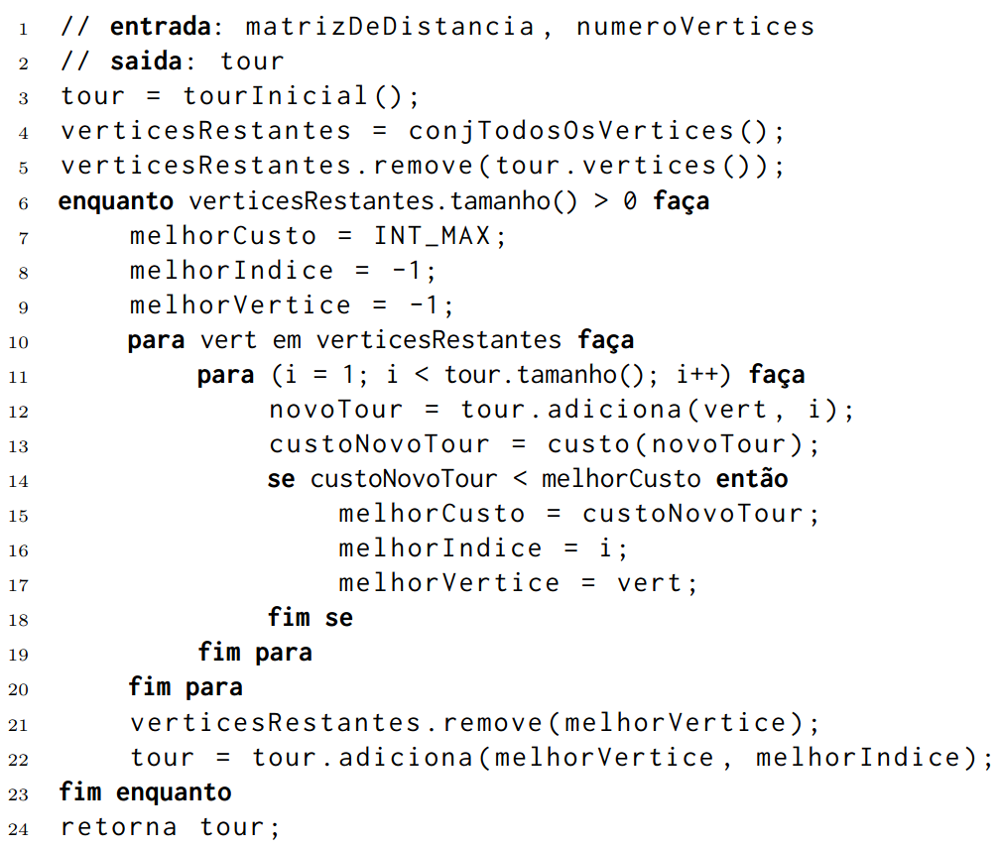{#fig-insercao-mais-barata}

:::

## Vizinho mais próximo

:::{layout-ncol=2 layout-valign="center"}
```{mermaid}
%%| fig-width: 10
graph TD
    B["Escolha uma aresta inicial"] --> C[Encontre o vizinho mais próximo não visitado]
    C --> D[Visite o vértice e marque como visitado]
    D --> E[Tour é parcial?]
    E -- Sim --> C
    E -- Não --> G[Fim]
```

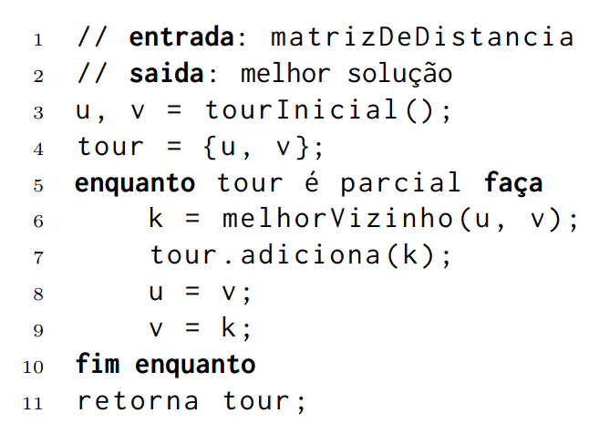{#fig-vizinho-mais-proximo}
:::

## Algoritmo genético{.smaller}

:::{layout-ncol=2}

```{mermaid}
graph TD
    B[Gere e avalie uma população inicial]
    B --> D[Seleção]
    D --> E[Crossover]
    E --> F[Mutação]
    F --> G[Substitua a população atual por novos descendentes]
    G --> H[Máximo número de avaliações foi atingido?]
    H -- Não --> D
    H -- Sim --> I[Fim]
```

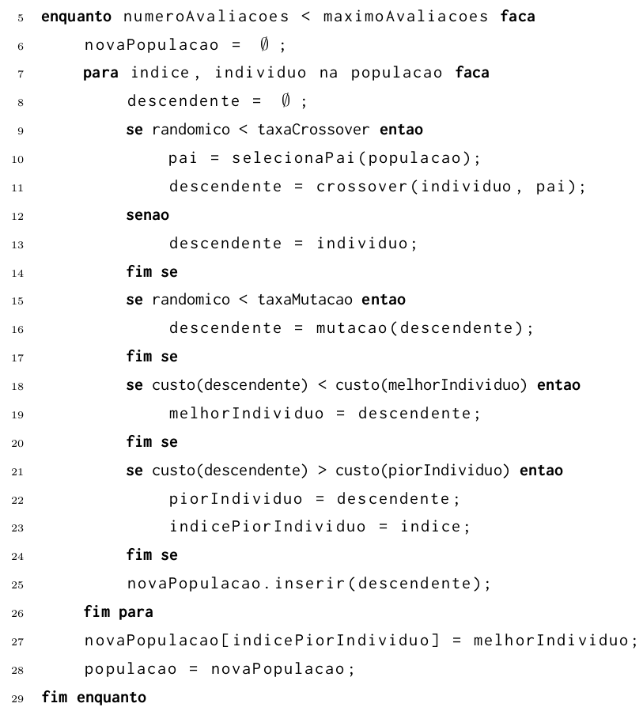{#fig-algoritmo-genetico-3}
:::

## Algoritmo genético 

::: {layout-ncol=2 layout-valign="center"}

::: {width=50%}
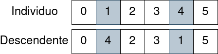{#fig-operacao-mutacao}
:::

::: {width=50%}
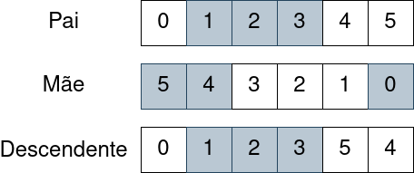{#fig-operacao-mutacao}
:::

:::

## Inicialização da população {.smaller}

:::{layout-ncol=2 layout-valign="center"}

```{mermaid}
graph TD
    B[Selecione um vértice inicial]
    B --> C[Selecione um vértice não inserido]
    C --> D[Encontre os k vizinhos mais próximos]
    D --> F["Gere um novo indivíduo com permutação <br> gulosa e adicione na população"]
    F --> H[Todos os vizinhos foram iterados?]
    H -- Sim --> J[Número de máximo de vértices foi atingido?]
    H -- Não --> D
    J -- Sim --> I["Fim"]
    J -- Não --> C
```

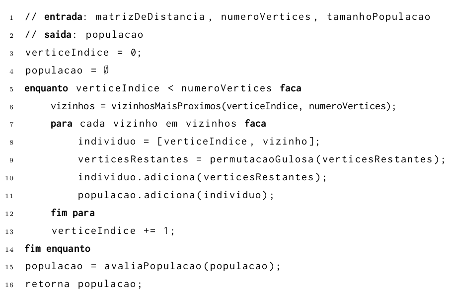{#fig-algoritmo-genetico-2}

:::

## Algoritmo memético {.smaller}

:::{layout-ncol=2 layout-valign="center"}

```{mermaid}
graph TD
    B[Gere e avalie uma população inicial]
    B --> D[Seleção]
    D --> E[Crossover e depois a mutação]
    E --> G[Busca local]
    G --> H[Substitua a população atual por novos descendentes]
    H --> I[Máximo número de avaliações foi atingido?]
    I -- Não --> D
    I -- Sim --> J[Fim]
```

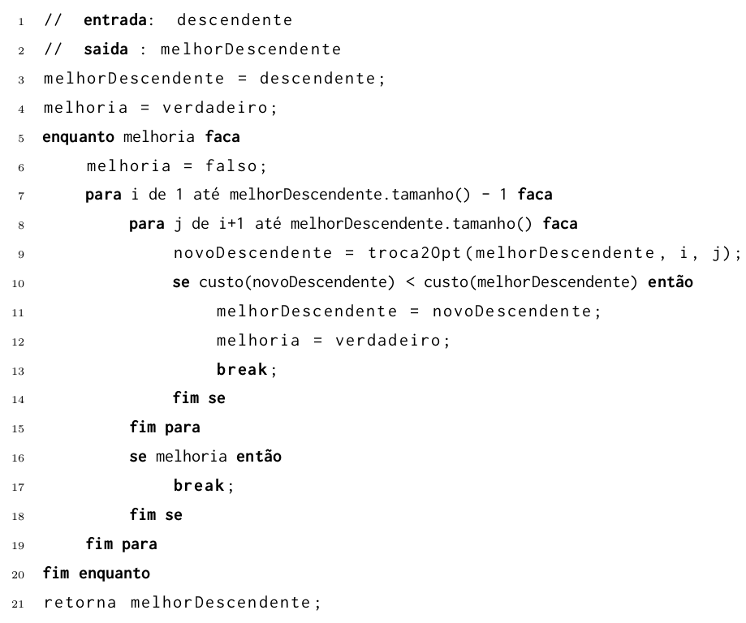{#fig-algoritmo-dois-opt}

:::

## Troca 2-opt

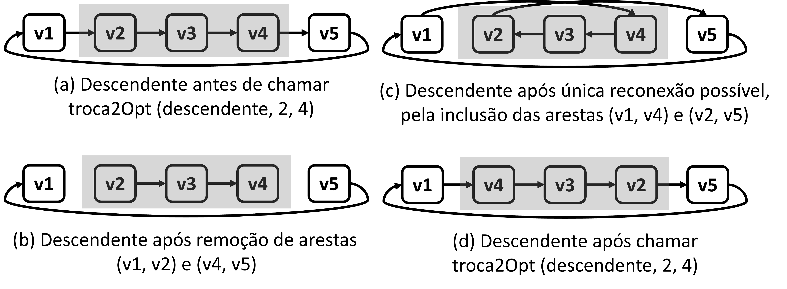{#fig-troca-dois-opt}

# Resultados

## Menores Instâncias

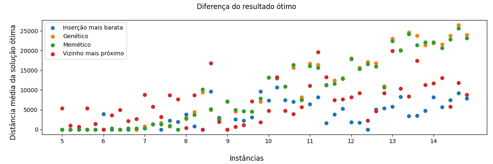

## Maiores Instâncias

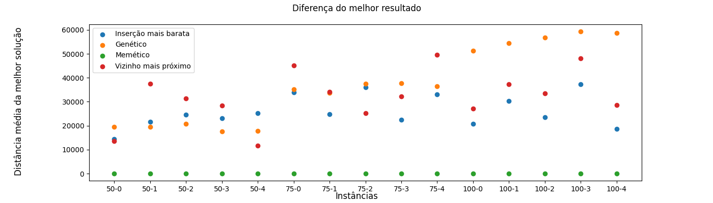

## Tempo de execução

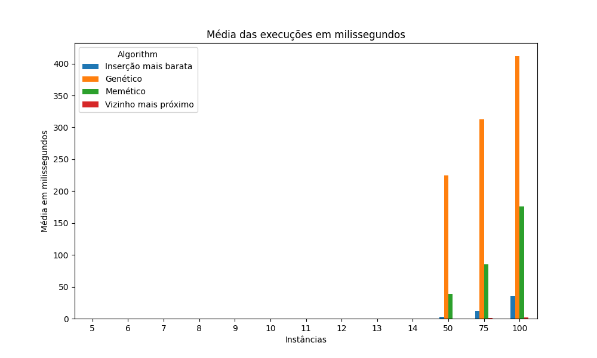

## Conclusões

- Objetivos propostos foram alcançados
- Vasta revisão bibliográfica
- Algoritmo memético se destacou em instâncias maiores
- Algoritmo da inserção mais barata se destacou em instâncias menores
- Algoritmo genético não teve resultados estatísticamente relevantes em comparação com as heurísticas

## Trabalhos futuros

- Explorar instâncias maiores e mais diversas
- Investigar a diversidade das populações geradas
- Investigar métodos de busca locais mais robustos
- Comparar soluções desenvolvidas com algoritmos de otimização mais recentes

# Obrigado!
